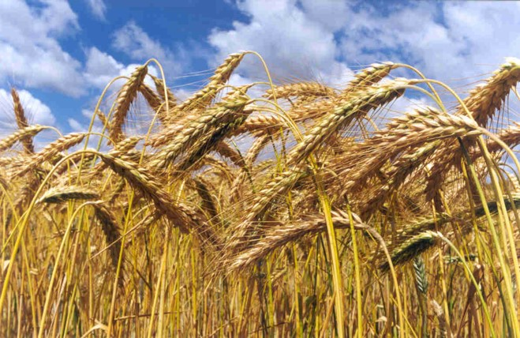
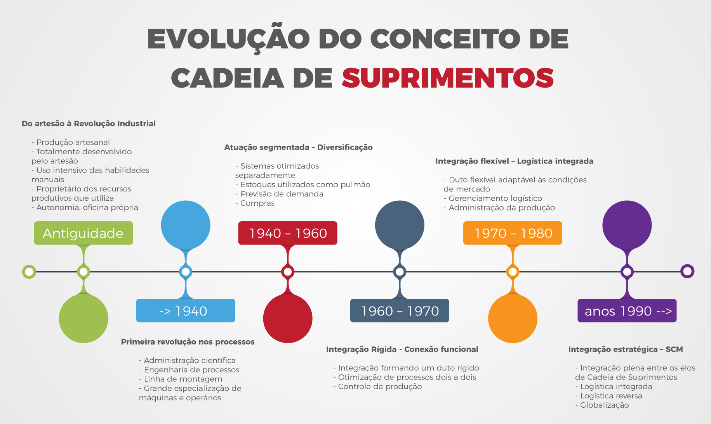

```{r setup, include=FALSE}
options(htmltools.dir.version = FALSE)
```

```{r xaringan-tile-view, echo=FALSE}
xaringanExtra::use_tile_view()
```

```{r xaringan-editable, echo=FALSE}
xaringanExtra::use_editable(expires = 1)
```

```{r xaringan-panelset, echo=FALSE}
xaringanExtra::use_panelset()
```

```{r xaringanExtra-clipboard, echo=FALSE}
htmltools::tagList(
  xaringanExtra::use_clipboard(
    button_text = "<i class=\"fa fa-clipboard\"></i>",
    success_text = "<i class=\"fa fa-check\" style=\"color: #90BE6D\"></i>",
    error_text = "<i class=\"fa fa-times-circle\" style=\"color: #F94144\"></i>"
  ),
  rmarkdown::html_dependency_font_awesome()
)
```

```{r xaringan-fit-screen, echo=FALSE}
xaringanExtra::use_fit_screen()
```

```{r xaringan-extra-styles, echo=FALSE}
xaringanExtra::use_extra_styles(
  hover_code_line = TRUE,         #<<
  mute_unhighlighted_code = TRUE  #<<
)
```

```{css echo=FALSE}
.panelset {
   --panel-tab-foreground: currentColor;
   --panel-tab-background: unset;
   --panel-tab-active-foreground: currentColor;
   --panel-tab-active-background: unset;
   --panel-tab-active-border-color: currentColor;
   --panel-tab-hover-foreground: currentColor;
   --panel-tab-hover-background: unset;
   --panel-tab-hover-border-color: #88398a;
   --panel-tab-inactive-opacity: 0.5;
   --panel-tabs-border-bottom: #ddd;
   --panel-tab-font-family: Menlo, Consolas, Monaco, Liberation Mono, Lucida Console, monospace;
}
```

## Proposta pedagógica

A intenção aqui é fazer com que o aprendizado seja mais dinâmico e ocorra de forma simultânea, fazendo com que o aluno tenha as bases teóricas e teste-as ao mesmo tempo.

A proposta pedagógica para desenvolvimento deste curso fundamenta-se no conceito de `Aprendizagem Baseada em Projetos`. São propostos `projetos incrementais` para apreensão do conhecimento e um `projeto integrador` para consolidação e perspectiva integrada da disciplina. 

---

## Ementa da disciplina

- Visão Geral da Logística.   
- A Cadeia de Suprimentos (Supply Chain) - conceitos principais.   
- Organização de Suprimentos: funções e objetivos.   
- Compras e fornecedores.   
- Armazenagem.   
- Gestão de Estoques.   
- Just-in-Time.   
- Avaliação do sistema suprimentos.  

---

## Objetivos de aprendizagem

Por meio desta disciplina, os alunos desenvolverão competências para:

1.  Desenvolvimento de um conhecimento claro dos elementos constitutivos das cadeias de suprimentos.
2.  Elaboração de estratégias para cadeia de suprimentos.
3.  Desenvolvimento de soluções logísticas.
4.  Integração da cadeia de suprimentos através do sistema de informações.


---

## Planejamento de encontros síncronos

Os encontros síncronos acontecerão nas **quartas-feiras**, de **19:00 às 20:30h**. Acontecerão na plataforma `discord`. 

Vocês poderão acessar o servidor da disciplina pelo [link](https://discord.gg/jaGyTYf7zy).

---
## Planejamento de encontros síncronos

.panelset[
.panel[.panel-name[Encontros]

| **Data**           | **CH** | **Assunto** |
|--------------------|--------|-------------|
| 13/01              |2h|Logística empresarial e a cadeia de suprimentos. 
| 20/01              |2h|Planejamento e gestão da cadeia de suprimentos.
| 27/01              |2h|KPIs em gestão de processos de produção e suprimento   
| 03/02              |2h|Nível de serviço logístico
| 10/02              |2h|Integração logística e sistemas de informação (ICT)
| 17/02              |2h|Transportes e distribuição física.
| 24/02              |2h|Transportes e distribuição física.
| 03/03              |2h|Localizações logísticas. 

]

.panel[.panel-name[Mais encontros...]

| **Data**           | **CH** | **Assunto** |
|--------------------|--------|-------------|
| 10/03              |2h|Custos logísticos.     
| 17/03              |2h|Logística reversa.
| 24/03              |2h|Logística urbana.
| 31/03              |2h|Logística urbana.
| 07/04              |2h|Logística urbana.
| 14/04              |2h|Logística urbana.
| 19/04              | |Exame especial.
| **Total de Horas** |        |30 horas             |
]
]

---

## Proposta de avaliação da aprendizagem

Pontos|	Entrega|	Atividade
------|--------|-----------
10|	03/02	| Projeto incremental 1
20|	09/03 |	Projeto incremental 2
20|	24/03	| Projeto incremental 3  
40|	07/04 |	Projeto integrador a ser detalhado ao longo da disciplina visando consolidar o conhecimento apreendido ao longo do curso.
10| 06/04 | Engajamento
TOTAL:| |	100 pontos

---
## Recursos necessários

Computador com Sistema Operacional à escolha do estudante, conexão à internet, câmera e microfone.

Os softwares a serem instalados são: 
Será necessário o uso de planilha eletrônica (o aplicativo pode ser de escolha do aluno) e ao longo da disciplina serão indicados aplicativos FOSS para outras análises.

Os alunos deverão ter uma conta gratuita na plataforma `discord`.

Turma Virtual do SIGAA para postagens de conteúdos e outras comunicações.

---

## Comunicação

Toda comunicação individual com a docente deverá acontecer por meio do email institucional do docente, deve conter no campo "assunto" o texto `<Log-adm>` e deve ser assinada com seu nome completo. Por favor, utilize o email institucional para comunicação com o docente: renataoliveira@cefetmg.br

Se o seu email não contempla alguma questão pessoal/individual, mas sim questionamentos e dúvidas sobre as atividades deste curso, por favor:

1. Verifique se a sua dúvida já foi respondida em algum post no `fórum-geral` no `Discord`.
2. Se não houver discussões sobre o tópico em questão, faça um novo post no `fórum-geral` no `Discord`. 

> Compartilhar as dúvidas e responder os questionamentos dos colegas é um excelente meio de aprendizagem.

---
class: inverse

## Políticas institucionais e da disciplina

.panelset[
.panel[.panel-name[Como interagir?]


O comparecimento aos encontros síncronos é desejável. A participação nesses encontros faz com que os estudantes tenham melhor desempenho. Entretanto, considerando todos os desafios proporcionados pelo ensino remoto, todo o conteúdo do curso será disponibilizado nas plataformas adotadas para condução das atividades. Você poderá participar das atividades remotamente usando o `fórum-geral` no `Discord`. Sua participação no Fórum será considerada para a avaliação desse curso no atributo `Engajamento`. 

1. Resposta a perguntas postadas pelos estudantes no `fórum-geral` no `Discord`. 
2. Participação em discussões e trabalhos em grupo na sala de aula. 
3. Identificação de problemas em relação à documentação apresentada.

]

.panel[.panel-name[Como agir?]

Os estudantes e professores têm a responsabilidade de manter um ambiente de aprendizagem adequado e motivante. 

A cortesia profissional e a sensibilidade são especialmente importantes no que diz respeito a indivíduos e discussões que lidam com diferenças de raça, cor, cultura, religião, credo, política, status de veterano, orientação sexual, gênero, identidade e expressão de gênero, idade, deficiência e nacionalidades. 

As listas de classes são fornecidas ao instrutor com o nome legal do aluno. Terei prazer em honrar seu pedido de dirigir-se a você por um nome alternativo ou pronome de gênero. Por favor, me informe essa preferência no início do semestre para que eu possa fazer as mudanças apropriadas em seus registros. Não serão tolerados atos de discriminação ou assédio contra ou por qualquer funcionário ou estudante.
]

.panel[.panel-name[Como trabalhar?]

Honestidade acadêmica é um princípio fundamental desta disciplina. Desonestidade acadêmica configura-se por: cópias literais de textos ou ideias sem citação de fonte, fabricações e falsificações de qualquer natureza, plágio, mentira, suborno, comportamento ameaçador ou cumplicidade com desonestidade acadêmica em qualquer nível. 

Os estudantes que forem considerados em violação da política de integridade acadêmica estarão sujeitos tanto a sanções acadêmicas do membro docente quanto a sanções não acadêmicas. Se você tiver alguma dúvida sobre citações adequadas, configuração de plágio, etc., por favor, não hesite em perguntar!
]
]

---

class: inverse, center, middle

## INTERVALO!!!!!!

## 5 MINUTOS!

---

class: inverse, center, middle

## Vamos falar sobre o `projeto integrador`?

---

## O que é o projeto integrador?

Este projeto será desenvolvido ao longo de toda a disciplina e deve ser relacionado com cada unidade de ensino. Seu conteúdo deve ser estruturado seguindo normas cultas de linguagem, clareza em relação ao problema em investigação e aos objetivos propostos. Consideraremos três dimensões para construção do projeto integrador:

- Situações-problemas: a aprendizagem deve ser iniciada com situações reais e do cotidiano. A ideia é criar um olhar investigativo para o mundo

- Conteúdos interdisciplinares e práticos: rompe com as fronteiras tradicionais do conhecimento, ao passo que relaciona disciplinas e até mesmo promove a articulação de áreas. Além disso, a produção de conhecimento do projeto integrador deve ser aplicável em situações reais.

- Trabalho coletivo: desenvolve as habilidades dos alunos para trabalhar em equipe.

---

## Etapas essenciais para desenvolvimento de um projeto de suporte à decisão que contemple análise de dados

.panelset[
.panel[.panel-name[Introdução]

Definição do problema - O primeiro e mais crítico passo é delinear as questões que pretende abordar por meio da análise de dados e desenhar hipóteses a partir da caracterização do problema.

]

.panel[.panel-name[Dados e exploração]

Coleta e organização de dados - A coleta de dados é um passo muito crucial e não tão fácil como parece. O processo requer tempo e esforço. Nenhum conjunto de dados contém dados como se espera e envolve pesquisa, arranjos, reordenações e montagem final. Faz-se necessária ainda a limpeza e transformação de dados - Se quiser que os seus resultados sejam consistentes, deve certificar-se de que a limpeza dos dados foi feita corretamente. Na essência, a limpeza de dados elimina dados desnecessários e duplicados da coleta de dados.

Representação e análise dos processos - representações gráficas permitem importantes insights sobre o fenômeno ou processo em investigação. É importante detectar tendências e padrões nos dados coletados, agrupá-los em conformidade, e compreender o comportamento dos dados para que seja possível caracterizar o processo em investigação.

]

.panel[.panel-name[Modelagem]

Modelagem dos dados - Nesta fase, os dados são divididos em duas partes - uma para formação e desenvolvimento de modelos, e a outra para testes. Nesta etapa podem também  Otimização e implementação do modelo - Nesta etapa, o modelo é implementado visando acurácia e eficiência das análises.

Nesse projeto, em função da natureza da disciplina que tem como objetivo formar estudantes para analisar e desenvolver pensamento crítico sobre a gestão da cadeia de suprimentos em diferentes contextos, esta etapa não será explorada no projeto integrador.


]

.panel[.panel-name[Comunicação]

Comunicação da análise, discussão e resultados. Nessa etapa, os grupos deverão reservar parte do instrumento de comunicação para discussão de aspectos positivos e negativos, riscos e implicações para a sociedade da cadeia de suprimentos em análise.
]
]


---

## Organização das atividades:

1. **Composição dos grupos de trabalho:** Cada grupo será composto por **4 (quatro) alunos**. Esse grupo deve se manter para realização dos `PROJETOS INCREMENTAIS`, realizadas após e antes dos encontros síncronos, e para construção do `PROJETO INTEGRADOR`. 

2. **Planejamento da execução do trabalho:** Definir um cronograma a priori, contemplando entregas parciais alinhadas com os projetos e acompanhar as etapas de execução. 

---

## Etapas para construção de um projeto de investigação da cadeia de suprimentos

.panelset[
.panel[.panel-name[Caracterização da oferta]

- Caracterização dos `intermediários mercadológicos`, estratégias de `procurement` e mapeamento dos `fluxos` e estratégias da cadeia de suprimentos em relação à sua `cadeia de valor`.

- Detalhamento da estrutura operacional dos pilares da cadeia de suprimentos. Nesta etapa é necessário detalhar métricas de mensuração financeira e operacional. Os pilares são:
  - Instalações
  - Estoque
  - Transportes
  - Informação
  - Procurement
  - Pricing
]

.panel[.panel-name[Caracterização da demanda]

- Detalhar a estratégia da empresa em relação à demanda final - mercado consumidor - considerando objetivos e metas no curto, médio e longo prazos e como é feita a previsão de demanda.

]

.panel[.panel-name[Custos]

- Caracterização dos elementos geradores de custo explorando trade-off entre responsividade e eficiência à luz das atividades-chave. 

]

.panel[.panel-name[Trade-off]

- Análise da estratégia em relação à coordenação da demanda e da oferta, os riscos, o outsourcing e a digitalização da cadeia de suprimentos. Explorar o conceito de compartilhamento na cadeia de suprimentos e os impactos do contexto disrruptivo nos fluxos e no abastecimento ao mercado.

]

.panel[.panel-name[Sustentabilidade]

- Implicações para a sociedade discutindo as tendências atuais e:
  - as relações de trabalho
  - o impacto ambiental
  - o impacto na qualidade de vida das pessoas
  - o impacto da estratégia empresarial na longevidade dos negócios envolvidos na cadeia de suprimentos
]
]

---

## Rubrica de avaliação

.panelset[
.panel[.panel-name[Onde?]

Embora a presença nos encontros síncronos não seja explicitamente acompanhada, a participação neste curso conta para sua nota. A seguir, são apresentados os critérios considerados para a avaliação do projeto integrador que são úteis para nortear o desenvolvimento do trabalho. Esta atividade será avaliada em `40 pontos`.

> Certifique-se que você está cadastrado ao servidor da disciplina no `Discord`, pois o processo de desenvolvimento do projeto será tão importante quanto seu resultado para a avaliação e eu acompanharei as discussões, análises e resultados por lá. 

]

.panel[.panel-name[Quanto?]

Os `40 pontos` serão distribuídos em: 

|Item|Pontuação
|----|-----------------
|Relatório/instrumento de comunicação|25
|Apresentação do projeto|5
|Trabalho em equipe - avaliação pelos pares|10

]

.panel[.panel-name[Notas?]

Discriminação geral da pontuação:

- `90%-100% `- **Esforço notável**. O estudante compreende como aplicar os fundamentos considerados na análise, pode argumentar de maneira consistente, pode identificar fraquezas no argumento e pode comunicar claramente os resultados.
- `80%-89%` - **Bom esforço**. O estudante compreende a maioria dos conceitos, reúne um argumento adequado, identifica alguns pontos fracos de seu argumento e comunica claramente a maioria dos resultados aos outros.
- `70%-79%` - **Esforço para aprovação**. O estudante tem uma má compreensão dos conceitos em diversas áreas, tem alguma dificuldade em juntar resultados em um argumento convincente, e a comunicação dos resultados às vezes não é clara.
- `60%-69%` - **Esforço limítrofe**. O estudante está fazendo algum esforço, mas tem uma má compreensão de muitos conceitos e é incapaz de montar um argumento convincente. A comunicação dos resultados não é clara.
- `Abaixo de 60%` - O estudante não está fazendo um esforço suficiente.
]
]
---

## Relatório/Instrumento de comunicação

.panelset[
.panel[.panel-name[Forma]

##### 1. Forma (5 pontos)

|Item|Pontuação
|----|-----------------
|A gramática e a ortografia são excelentes - sem erros de ortografia, concordância, linguagem não formal|1
|A estrutura do documento está alinhada com as demandas do projeto|2
|Citações, elementos pictóricos e outras construções no texto estão conforme norma ABNT|2

]

.panel[.panel-name[Caracterização do problema]


##### 2. Caracterização inicial do problema em análise (8 pontos)
|Item|Pontuação
|----|-----------------
|Relevância do problema para o contexto organizacional|4
|Pertinência das hipóteses geradas|2
|Consistência do objetivo geral proposto|2

]

.panel[.panel-name[Análise]

##### 3. Organização dos dados e instrumentos de análise (5 pontos)

|Item|Pontuação
|----|-----------------
|Escolha das fontes para coleta de dados|1
|Organização final dos dados |1
|Escolha e implementação das variáveis e indicadores para análise|2
|Escolha e implementação dos instrumentos de visualização|1

]
.panel[.panel-name[Resultados]

##### 4. Resultados e discussões (7 pontos)

|Item|Pontuação
|----|-----------------
|Interpretação das condicionantes dos problemas em investigação|2
|Discussão dos dados em relação às hipóteses inicialmente determinadas|1
|Discussão das implicações no curto, médio e longo prazos para a sociedade|2
|Criatividade e pensamento crítico|2

]

]

---
## Apresentação do projeto (5 pontos)

.panelset[
.panel[.panel-name[Como?]

10 minutos no máximo, e cada membro da equipe deve dizer algo substancial. Você pode apresentar ao vivo durante o encontro ou pré-gravar e enviar seu vídeo para ser reproduzido durante o encontro. 

Não há um limite para quantos slides você pode usar, apenas um limite de tempo (10 minutos no total). 

Cada membro da equipe deve ter a oportunidade de falar durante a apresentação. Sua apresentação não deve ser apenas um relato de tudo o que você tentou ("então fizemos isto, depois fizemos isto, etc."), mas deve transmitir **quais escolhas você fez, e por quê, e o que você encontrou**.


]

.panel[.panel-name[Quanto?]

O esquema de notas (rubrica) para a apresentação é o seguinte:

|Item|Pontuação
|----|-----------------
|Gerenciamento de tempo: A equipe dividiu bem o tempo entre si ou foi cortada ao longo do tempo?	|1
|Conteúdo: A questão da pesquisa está bem projetada e os dados estão sendo usados de forma relevante para a questão da pesquisa?|1
|Profissionalismo: Até que ponto a equipe se apresentou bem? A apresentação parece ter sido bem praticada? Todos tiveram a oportunidade de dizer algo significativo sobre o projeto?|1
|Trabalho em equipe: A equipe apresentou uma história unificada, ou pareceu um trabalho independente remendado em conjunto?|1
|Slides: Os slides são bem organizados, legíveis, não estão cheios de texto, apresentando figuras com etiquetas legíveis, lendas, etc.?|1

]
]
---

## Trabalho em equipe - avaliação pelos pares (10 pontos)

Você deverá preencher uma pesquisa onde avaliará a contribuição e o trabalho em equipe de cada membro da **SUA** equipe em `10 pontos`.

Além disso, você informará um percentual de contribuição para cada membro da equipe. O preenchimento desse formulário é um pré-requisito para obtenção de crédito na avaliação do membro da equipe. 

Se você estiver sugerindo que um indivíduo fez menos de 20% do trabalho, por favor, dê alguma explicação. Se qualquer indivíduo obtiver uma pontuação média de colegas indicando que fez menos de 10% do trabalho, essa pessoa receberá metade da nota do resto do grupo.

---
class: center, middle


```{r echo=FALSE, message=FALSE, warning=FALSE}

```

---

class: inverse, center, middle

## POP-QUIZ

Resolver as palavras cruzadas no Moodle! 

### 3 minutos

---


# O que é Logística?

.center[
### “Logística é dispor a mercadoria ou o serviço certo, no lugar certo, no tempo certo e nas condições desejadas, ao mesmo tempo em que fornece a maior contribuição à empresa” 
(Ballou, 2001)
]
---

# O que é uma cadeia de suprimentos?

A cadeia de suprimentos é a integração dos processos industriais e comerciais, partindo dos fornecedores iniciais até o consumidor final, gerando produtos, serviços e informações que agreguem valor para o cliente, maximizando a lucratividade total.

```{r echo=FALSE, message=FALSE, warning=FALSE}
knitr::include_graphics("./img/supply-chain.jpg")
```
---

# Como esses conceitos passaram a fazer parte das nossas vidas?

.pull-left[
```{r echo=FALSE, message=FALSE, warning=FALSE}

```
```{r echo=FALSE, message=FALSE, warning=FALSE}
knitr::include_graphics("./img/log3.jpg")
```
]

.pull-right[
```{r echo=FALSE, message=FALSE, warning=FALSE}

```
]

---
# Evolução da logística 

```{r echo=FALSE, message=FALSE, warning=FALSE}

```

---

class: inverse, center, middle

## ATIVIDADE DA SEMANA

Quem comporá cada grupo de trabalho?

---
class: center, middle

# DÚVIDAS?